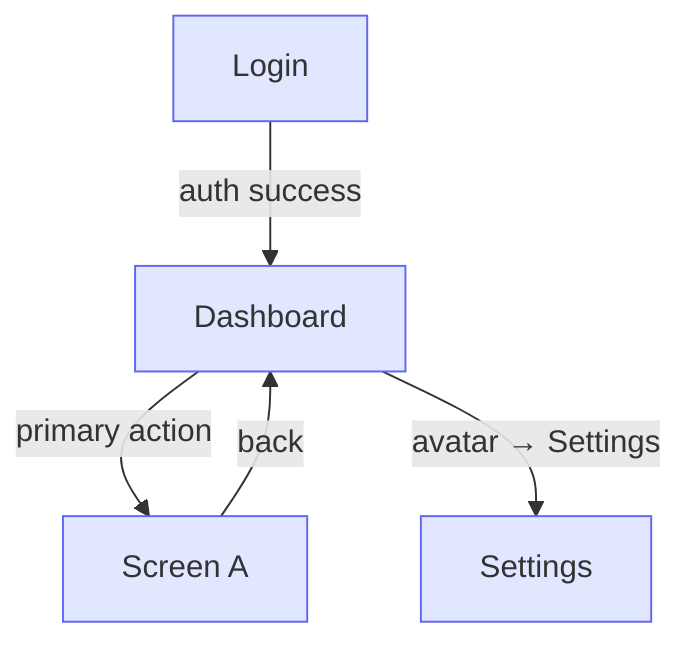

# Constitution schemas — `mission.md` · `product.md` · `tech-stack.md`

Three separate project files, one schema doc. `/build:spec` constitution mode (Step 1.5) authors all three from one drafter brief. `/build:spec` replan mode updates all three every phase — they record the product **as actually built**, not the original plan. `roadmap.md` has its own schema; it is authored later, at Step 1.6.

Copy each template below into its own file at the project root.

---

# mission.md

```markdown
# Mission — [Project Name]

## Purpose
[One sentence: what this product does for the user. The outcome, not a feature list.]

## Target Users
[Who uses this and what they are trying to accomplish. Name the actual person and their goal.]

## Vision & Tone
[What experience this creates. One paragraph. Not features — the feeling and direction.]

## Success Looks Like
[Specific and observable. What does a user do or say when the product is working well?]

## Master User Journey
[The end-to-end path a user takes through the finished product, start to finish, as Named Flows. This is what the final phase's unfenced dogfood walks. Each flow names the phase that delivers it.]

## Design Tool
[The current phase's `/build:design` track — `claude-code` or `external` (optionally note the tool, e.g. `external:<tool>`). Written by `/build:design` at the start of each phase, read by `/build:review` to know which compliance rules apply. Overwritten every phase.]

## Design North Star
[The one thing a user should remember or feel after using the product. Asked once by `/build:design` at the Phase 0 brief and carried forward unchanged — one app, one north star. Copied into every phase's design brief `## Design intent`. Written by `/build:design`, never filled by hand.]
```

---

# product.md

The phase-start drift anchor. It must reflect reality, not the original vision.

```markdown
# Product — [Project Name]

## End-State Vision
[One paragraph. What the finished product looks and feels like to use. Not a feature list — the experience: pace, density, complexity level, primary metaphor.]

## Screen Inventory
All screens, built or planned. Status updated each phase. Only `built`/`changed` rows are App Map and reachability nodes — `planned` is future bookkeeping.

**Status:** `built` · `planned` · `removed` (keep the row, note why) · `changed` (note how in Purpose).

| Screen | Purpose | Phase | Status |
|--------|---------|-------|--------|
| [Name] | [What the user accomplishes here] | Ph1 | built |
| [Name] | [What the user accomplishes here] | Ph2 | planned |

## Navigation Structure
[How screens connect. Flat map, not a sitemap diagram. Format: Screen → [action] → Screen. Group by area if the product has distinct sections.]

## App Map
[Mermaid flowchart of Screen Inventory + Navigation Structure. Shown at the constitution gate. Screens = nodes, user actions = edges. Color each node by the phase that wires it live. Derived view — regenerate when the two sections above change, never hand-maintain. Every screen must be reachable from home and able to return; a dead-end node (arrows in, none out) is the bug this map exists to surface.]



## Core Feature Surface
What a user can do at end-state. Concrete actions, not jobs-to-be-done.

- [Feature]: [one line on what it does and why it matters to the user]

## Named Flows
[End-to-end step sequences, each step labelled with the phase that delivers it. These are the anchor — user stories in every phase spec reference these flows by name.]

- **[Flow name]:** Step 1 (Ph1) → Step 2 (Ph1) → Step 3 (Ph2) → Step 4 (Ph3)

## Phase 0 Foundation Scope
[The shell + hero screens — home/dashboard plus 1-2 top nav screens — built to final visual polish: static, mock data, pixel-complete, not wired. Non-hero screens are built in their own phase.]

- [Hero screen name] — built static in Phase 0; wired live in Phase [N] ([feature])
```

---

# tech-stack.md

The widest-read doc in a build. Stack choices plus the rules nothing may break.

```markdown
# Tech Stack — [Project Name]

## Choices
- **Language:**
- **Frontend framework:**
- **Backend framework:**
- **Database:**
- **Hosting / Deployment:**
- **Key libraries:**
- **Testing:**

## Constraints & Non-Negotiables
[Rules that apply from day one and cannot be broken. Examples: "strict TypeScript from commit 1", "no ORM — plain SQL only", "all dependencies pinned exactly, no ^ or ~ prefixes".]

- [Constraint]

## Explicit Exclusions
[What this stack deliberately does NOT use, and why. Exclusions prevent scope creep and wrong assumptions by agents.]

- **[Technology]:** [Why excluded]

## Key Technical Decisions

| Decision | Why | Alternatives Rejected |
|----------|-----|-----------------------|
| [What was decided] | [Reason] | [What was considered and rejected] |
```
