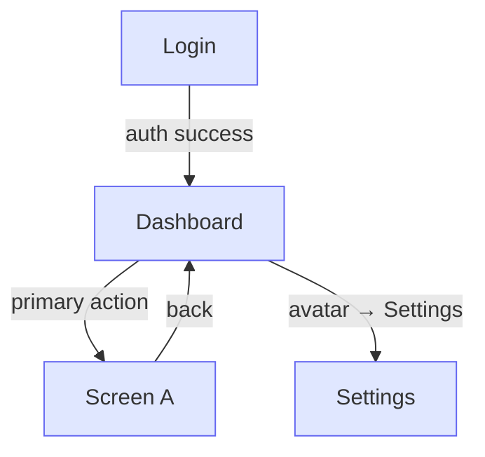

# Product — [Project Name]

> **Maintained per phase, not frozen.** This is the product *as actually built*, not the original plan. `/build-spec` (replan mode) updates it every phase — add new screens, mark ones that were removed or shipped differently, and regenerate the App Map. The phase-start re-board reads this as the drift anchor, so it must reflect reality, not the original vision.

## End-State Vision
[One paragraph. What the finished product looks and feels like to use. Not a feature list —
the experience: pace, density, complexity level, primary metaphor.]

## Screen Inventory
All screens in the finished product. `/build-spec` (replan mode) updates status each phase.

**Status:** `built` · `planned` · `removed` (keep row, note why) · `changed` (note how in Purpose).

| Screen | Purpose | Phase | Status |
|--------|---------|-------|--------|
| [Name] | [What the user accomplishes here] | Ph1 | built |
| [Name] | [What the user accomplishes here] | Ph1 | built |
| [Name] | [What the user accomplishes here] | Ph2 | planned |

## Navigation Structure
[How screens connect. Flat map — not a sitemap diagram, just the paths.
Format: Screen → [action] → Screen. Group by area if the product has distinct sections.]

## App Map
[Mermaid flowchart of Screen Inventory + Navigation Structure. Shown at the constitution gate. Screens = nodes, user actions = edges. Color each node by the phase that wires it live. Derived view — regenerate when the two sections above change, never hand-maintain. Every screen must be reachable from home and able to return; a dead-end node (arrows in, none out) is a bug this map exists to surface.]

## Core Feature Surface
What a user can do at end-state. Concrete actions, not jobs-to-be-done.

- [Feature]: [one line on what it does and why it matters to the user]
- [Feature]: [one line]

## Named Flows
[End-to-end step sequences. Each step labeled with the phase that delivers it.
These are the anchor — user stories in each phase spec reference these flows by name.]

- **[Flow name]:** Step 1 (Ph1) → Step 2 (Ph1) → Step 3 (Ph2) → Step 4 (Ph3)

## Phase 0 Foundation Scope
[Every screen built to final visual polish — static, mock data, pixel-complete, not wired. Lists every screen and the slice that wires it live.]

- [Screen name] — built static in Phase 0; wired live in Phase [N] ([feature])
- [Screen name] — built static in Phase 0; wired live in Phase [N] ([feature])
